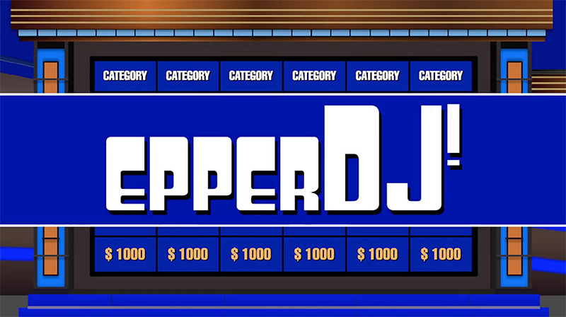
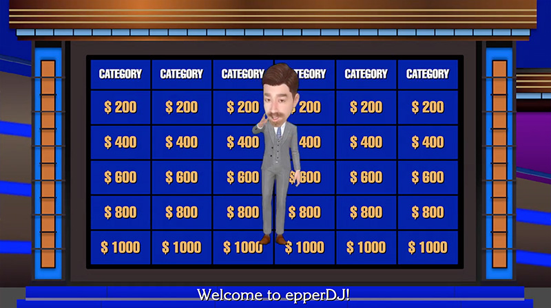
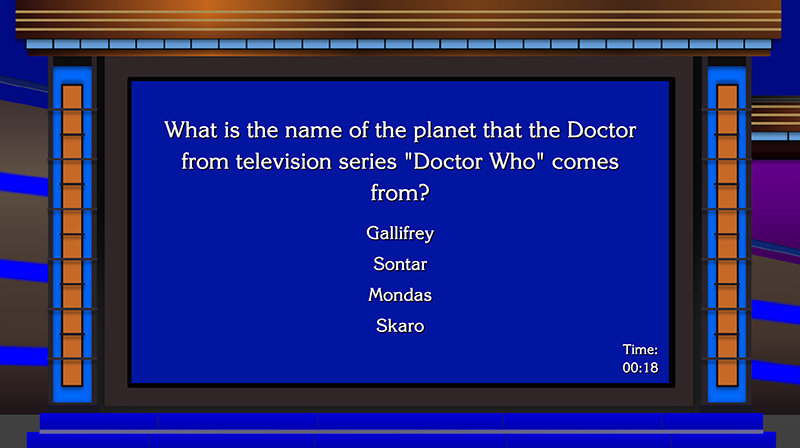

# Trivia Game -- epperDJ!

Deployed version available [here](https://crsaxton87.github.io/TriviaGame/).

### Overview

A trivia game imitating the one that you're thinking of using API-fed questions from the Open Trivia DB. The original intention of this assignment was to demonstrate the use of timers in Javascript, but I wanted to go a bit further, so I implemented the following:

- An animated intro, starring a 3D version of myself as the host
- Jeopardy style play, incorporating six categories to choose from and a difficulty system
- Queries to the Open Trivia Database to generate unique categories and questions for each play through

### How to play

After the opening animation, click a square with a number value in the category of your choice. 

The question will open and you will have four answers to choose from. The timer is set for 20 seconds and a time up, correct choice, or incorrect choice will display the correct answer and then return you to the main board. 

When all of the questions have been answered, a screen will display with how many correct and incorrect answers you gave and also a button to reset the game and start a new round.
